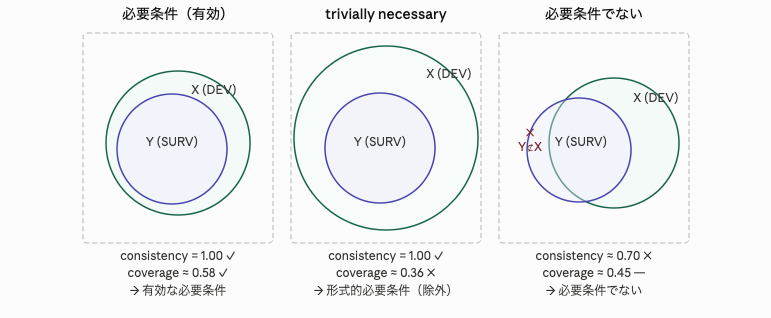

```{r setup}
library(QCA)
library(ggplot2)
library(dplyr)
library(tidyr)
library(knitr)
library(ggrepel)
library(patchwork)
library(showtext)
library(tibble)

if (Sys.info()[["sysname"]] == "Darwin") {
  font_add("jpfont", "/System/Library/Fonts/ヒラギノ角ゴシック W3.ttc")
} else {
  noto_path <- list.files("/usr/share/fonts",
                          pattern = "NotoSansCJK.*\\.ttc",
                          recursive = TRUE, full.names = TRUE)[1]
  font_add("jpfont", noto_path)
}
showtext_auto()
knitr::opts_chunk$set(fig.showtext = TRUE)

theme_set(theme_bw(base_size = 12, base_family = "jpfont"))
```

## 1. 背景と研究問いの設定

Lipset (1959) は「豊かさ・工業化・教育・都市化が民主主義の持続を促す」という命題を提示した。
本分析では `QCA` パッケージ付属の **18 か国データ** を用い、
**Fuzzy-Set QCA (fsQCA)** によって民主主義生存 (`SURV`) の十分条件・必要条件を特定する。


### リサーチクエスチョン.  
#### 主RQ：    
Lipset (1959) が提唱する4条件（経済発展・都市化・識字率・工業化）のいかなる単独条件および条件の組み合わせが、18か国における民主主義の生存（SURV）の十分条件・必要条件を構成するか？   

#### 副RQ-1（必要条件）：    
4条件のうち、SURV に対して高一貫性（consistency ≥ 0.9）をもつ必要条件となる単独条件は何か？trivially necessary（coverage が極端に低い条件）はどれか？   

| 仮説 | 内容 | 集合表記 |
|------|--------------|------|
| H-N1 | 経済発展（DEV）は SURV の必要条件である | SURV ⊆ DEV | 
| H-N2 | 識字率（LITI）は SURV の必要条件である| SURV ⊆ LIT | 
| H-N3 | 都市化（URB）は SURV の必要条件である| SURV ⊆ URB | 


#### 副RQ-2（十分条件）：    
SURV を導く十分条件構成はどのように記述されるか。また複数の経路（等結果性, equifinality）は確認されるか？   

十分条件仮説（Sufficiency）.  

| 仮説 | 内容 | 集合表記 |
|------|--------------|------|
| H-S1 | 高経済発展 × 高識字率は SURV の十分条件構成に含まれる | DEV ∗ LITI ⊆ SURV | 
| H-S2 | 4条件すべての高スコア組み合わせは SURV の十分条件となる| DEV ∗ URB ∗ LITI ∗ INDUS ⊆ SURV | 
| H-S3 | 低経済発展 × 低識字率は ~SURV の十分条件構成に含まれる| ~DEV ∗ ~LITI ⊆ ~SURV | 

等結果性仮説（Equifinality）.  

| 仮説 | 内容 | 
|------|--------------|
| H-E | SURV を導く十分条件パスは複数存在する（解の論理式が OR 結合の複数項から構成される） | 


#### 副RQ-3（非対称性）：     
民主主義の持続（SURV）と崩壊（~SURV）の十分条件構成は対称的か、非対称的か？

非対称性仮説（Asymmetry）.  

| 仮説 | 内容 | 
|------|--------------|
| H-A | SURV の十分条件構成は ~SURV の十分条件構成と単純な論理否定関係にない（因果非対称性） | 


#### 変数一覧:

| 変数 | 内容 | 指標・計算方法 | ファジィ化の閾値 | 出典 |
|------|------|--------------|----------------|------|
| `DEV` | 経済発展度 | 一人当たり GDP（USD）。戦間期の各国の経済規模を人口で除した値 | クロスオーバー: 550 USD（以下 → 0 寄り、以上 → 1 寄り） | Lipset (1959); Rihoux & De Meur (2009) |
| `URB` | 都市化率 | 人口 20,000 人以上の都市に居住する人口の割合（%） | クロスオーバー: 50%（以下 → 0 寄り、以上 → 1 寄り） | Lipset (1959); Rihoux & De Meur (2009) |
| `LIT` | 識字率 | 識字人口の割合（%）。読み書き可能な成人の比率 | クロスオーバー: 75%（以下 → 0 寄り、以上 → 1 寄り） | Lipset (1959); Rihoux & De Meur (2009) |
| `IND` | 工業化度 | 工業部門に従事する労働力の割合（%） | クロスオーバー: 30%（以下 → 0 寄り、以上 → 1 寄り） | Lipset (1959); Rihoux & De Meur (2009) |
| `STB` | 政府の安定性 | 研究対象期間中に政権を担った内閣数（少ないほど安定）。政治制度的条件 | クロスオーバー: 内閣数 10（10 以上 → 不安定 = 0 寄り、10 未満 → 安定 = 1 寄り） | Cronqvist & Berg-Schlosser (2009) |
| `SURV` | 民主主義の生存（アウトカム） | 戦間期における民主主義体制の持続の有無。生存した場合 1、崩壊した場合 0 として二値のファジィスコアに変換 | 0（崩壊）/ 1（生存）の二値 | Lipset (1959); Ragin (2009) |

#### 分析の流れ
1.必要条件分析.   
各条件 X と 否定 ~X について、pof(X, SURV, ...) を実施。   

・判定基準は consistency ≥ 0.9 かつ coverage > 0.5（trivially necessary を排除）.  
・superSubset() によるスーパーセット関係も確認.  

補足).




一貫性(consistency)の定義は以下.  
「どの程度 生存(SURV) が 条件(DEVなど) に収まっているか」
$$
\text{consistency}(Y \subseteq X) = \frac{\sum_i \min(Y_i,\, X_i)}{\sum_i Y_i}
$$

カバレッジ(coverage)の定義は以下.   
「条件(DEVなど)が生存(SURV)の説明にどれだけ貢献しているか」.  
カバレッジが小さい=> 必要条件であっても説明力が乏しい（trivially necessary）可能性がある.  
$$
\text{coverage}(Y \subseteq X) = \frac{\sum_i \min(Y_i,\, X_i)}{\sum_i X_i}
$$

・スーパーセット：superSubset() は、個別条件での必要・十分だけでなく、論理和の結合を含む一貫性とカバレッジを検討する. 


2.十分条件分析（真理値表分析） 
・4変数の組み合わせ(2⁴=16)行の真理値表を構築し、minimize() で Conservative (C)・Parsimonious (P)・Intermediate (I) の3解を導出.  
・SURV に加えて ~SURV を従属変数とした並行分析も実施し、因果非対称性を検証する.  


---

## 2. データの確認

```{r load-data}
data(LF)    # Lipset fuzzy-set data (already calibrated, 0–1)
# declared クラスを素の numeric に変換（pivot_longer の型エラー回避）
df <- as.data.frame(lapply(LF, as.numeric))
rownames(df) <- rownames(LF)
kable(head(df, 10), digits = 3, caption = "LF データ（先頭 10 行）")
```

```{r data-summary}
df |>
  summarise(across(everything(), list(mean = mean, sd = sd, min = min, max = max))) |>
  pivot_longer(everything(),
               names_to = c("variable", ".value"),
               names_sep = "_(?=[^_]+$)") |>
  kable(digits = 3, caption = "記述統計")
```

```{r dist-plot, fig.cap="各変数の分布（ファジィスコア）"}
df |>
  pivot_longer(everything(), names_to = "variable", values_to = "score") |>
  ggplot(aes(x = score, fill = variable)) +
  geom_histogram(bins = 12, alpha = 0.8, color = "white") +
  facet_wrap(~variable, scales = "free_y") +
  scale_fill_brewer(palette = "Set2", guide = "none") +
  labs(x = "Fuzzy スコア", y = "度数",
       title = "Lipset 変数のファジィスコア分布")
```

---

## 3. キャリブレーションの確認

`LF` はすでに direct method でキャリブレーション済みの fsQCA データ。
`SURV` を 0.5 クロスオーバー点で二値化したときのケース分布を確認する。

```{r calibration-check, fig.cap="SURV スコアとケースラベル"}
df_label <- df |> mutate(case = rownames(df),
                         demo = ifelse(SURV >= 0.5, "民主的生存 (≥0.5)", "非生存 (<0.5)"))

ggplot(df_label, aes(x = reorder(case, SURV), y = SURV, fill = demo)) +
  geom_col(alpha = 0.85) +
  geom_hline(yintercept = 0.5, linetype = "dashed", color = "red") +
  coord_flip() +
  scale_fill_manual(values = c("民主的生存 (≥0.5)" = "#2196F3",
                               "非生存 (<0.5)"     = "#FF7043")) +
  labs(x = NULL, y = "SURV (fuzzy)", fill = NULL,
       title = "民主主義生存スコア（0.5 = クロスオーバー）")
```

---

## 4. 必要条件分析

**民主主義における「必要条件」の意味**

ある条件 X が民主主義生存（`SURV`）の必要条件であるとは、
「民主主義が生存しているすべての国は、必ず X を備えている」ことを意味する。
言い換えれば、X がなければ民主主義は生存できない——X は民主主義生存の *前提* である。

例: 識字率（`LIT`）が必要条件であれば、「識字率の低い国では民主主義は生存しない」という命題が成立する。
ただし必要条件は十分条件ではないため、識字率が高くても民主主義が生存するとは限らない。

**一貫性（Consistency）とカバレッジ（Coverage）の定義**

| 指標 | 定義式（概念） | 解釈 | 判断基準 |
|------|--------------|------|----------|
| **一貫性** (inclN) | アウトカムが 1 のケースのうち、条件スコアがアウトカムスコア以上である割合（加重） | 「条件を持つ国は民主主義が生存している」という命題がどれだけ成立するか。1 に近いほど反証ケースが少なく、必要条件として信頼できる | > 0.90 で必要条件候補 |
| **カバレッジ** (covN) | 条件が 1 のケースのうち、アウトカムも 1 であるケースの割合（加重） | 「その条件が民主主義生存の説明にどれだけ貢献しているか」を示す。低い場合、条件は確かに必要だが些細（trivially necessary）な可能性がある | 一貫性が高くても covN が低い条件は解釈に注意 |

アウトカム `SURV` に対して各条件が **必要条件** か検定する。   

### 4.1 必要条件の判断基準: 一貫性 (consistency) > 0.90

```{r necessary}
nc_results <- lapply(
  setdiff(names(df), "SURV"),
  function(cond) {
    r <- pof(df[[cond]], df$SURV, relation = "nec")
    data.frame(
      条件       = cond,
      一貫性     = round(r$incl.cov$inclN, 3),
      カバレッジ = round(r$incl.cov$covN,  3)
    )
  }
)

nc_df <- bind_rows(nc_results) |> arrange(desc(一貫性))

kable(nc_df, caption = "必要条件分析")
```

```{r nec-plot, fig.cap="必要条件: 一貫性 vs. カバレッジ"}
nc_df |>
  ggplot(aes(x = カバレッジ, y = 一貫性, label = 条件)) +
  geom_point(aes(color = 一貫性 > 0.90), size = 4) +
  geom_text_repel(size = 4) +
  geom_hline(yintercept = 0.90, linetype = "dashed", color = "red") +
  scale_color_manual(values = c("FALSE" = "grey60", "TRUE" = "#2196F3"),
                     labels = c("FALSE" = "< 0.90", "TRUE" = "≥ 0.90 (必要条件候補)"),
                     name = "一貫性") +
  labs(title = "必要条件: 一貫性とカバレッジ",
       subtitle = "破線 = 一貫性 0.90 閾値")
```

### 4.2 スーパーセット分析（論理和を含む必要条件候補）

単独条件だけでなく、**論理和（OR）結合**を含む条件の組み合わせも必要条件候補として検討する。
`superSubset()` は、consistency ≥ 0.90 かつ coverage ≥ 0.50 を満たすすべてのスーパーセット（単独・OR結合）を列挙する。

- **RoN（Relevance of Necessity）**: 必要条件の実質的な重要性を示す補正指標。
  RoN が低い場合、条件は確かに必要だが「ほぼ常に成立する自明な条件（trivially necessary）」である可能性がある。RoN > 0.5 を有効な必要条件の目安とする。

・RoN0.5 以上の条件は必要条件候補として注目されるが、RoN が極端に低い条件は解釈に注意が必要である.  
・識字率(LIT) & 安定性(STB)がRoN=0.8、発展(DEV)&都市化(URB)&工業化(IND)がRoN=0.7で、それぞれ組み合わせとして、*民主国家にこの組み合わせが多く、非民主国家にこの組み合わせが少ない* ことを示す.   

$$
\text{RoN}(Y \subseteq X) = 1 - \frac{\sum_i \min(X_i,\; 1 - Y_i)}{\sum_i (1 - Y_i)}
$$


```{r supsubset}
ss <- superSubset(df, outcome = "SURV", incl.cut = 0.9, cov.cut = 0.5)

as.data.frame(ss$incl.cov) |>
  tibble::rownames_to_column("条件式") |>
  rename(一貫性 = inclN, RoN = RoN, カバレッジ = covN) |>
  arrange(desc(一貫性)) |>
  kable(digits = 3, caption = "スーパーセット分析（inclN ≥ 0.90, covN ≥ 0.50）")
```

---

## 5. 十分条件分析（Truth Table）

**民主主義における「十分条件」の意味**

ある条件の組み合わせ X が民主主義生存（`SURV`）の十分条件であるとは、
「X を備えた国は、民主主義が生存する」ことを意味する。
言い換えれば、X さえあれば民主主義は生存できる——X は民主主義生存を *保証する経路* である。

fsQCA では複数の十分条件（解）が得られることがあり、それぞれが民主主義生存への異なる歴史的経路（INUS 条件）を示す。
例: 「高い経済発展度 × 高い都市化率 × 高い識字率 × …」という組み合わせが十分条件であれば、
この条件セットを満たす国はおおむね民主主義が生存している。

### 5.1 真理表の構築

```{r truth-table}
conds <- setdiff(names(df), "SURV")

tt <- truthTable(
  data      = df,
  outcome   = "SURV",
  conditions = conds,
  incl.cut  = 0.8,   # 一貫性閾値
  n.cut     = 1,     # 最小ケース数
  show.cases = TRUE,
  complete  = FALSE
)

tt
```

```{r tt-plot, fig.cap="真理表: 一貫性スコアの分布"}
tt_df <- as.data.frame(tt$tt)

ggplot(tt_df, aes(x = seq_len(nrow(tt_df)), y = incl,
                  fill = OUT == "1")) +
  geom_col(alpha = 0.85) +
  geom_hline(yintercept = 0.8, linetype = "dashed", color = "red") +
  scale_fill_manual(values = c("FALSE" = "#FF7043", "TRUE" = "#4CAF50"),
                    labels = c("FALSE" = "OUT=0/C", "TRUE" = "OUT=1"),
                    name = "アウトカム") +
  labs(x = "真理表行", y = "一貫性 (incl)",
       title = "各真理表行の一貫性スコア",
       subtitle = "破線 = 閾値 0.80")
```

### 5.2 最小化（Quine–McCluskey）

QCA の最小化結果には以下の指標が付される。

| 指標 | 正式名称 | 定義 | 目安 |
|------|----------|------|------|
| `inclS` | Sufficiency Inclusion | 解の十分性一貫性。条件スコアがアウトカムスコアを超えないケースの割合（加重）。高いほど「条件 → アウトカム」の関係が安定。 | > 0.75 を目安 |
| `PRI` | Proportional Reduction in Inconsistency | 因果的非対称性の指標。アウトカムが 1 のケースと 0 のケースを同時に説明している重複を補正した一貫性。`inclS` より保守的。 | > 0.50 を目安 |
| `covS` | Sufficiency Coverage (raw) | 解がアウトカムをどれだけカバーするか（粗カバレッジ）。アウトカムが 1 のケースのうち解が包含する割合。 | 高いほど説明力が大きい |
| `covU` | Unique Coverage | 他の解では説明できず、当該解のみが説明するアウトカムの割合。複数解がある場合に各解の独自貢献度を示す。 | 高いほど独自性が大きい |


#### 結果.  
・民主主義生存(SURV)は、以下の組み合わせで全体の約65.8%を説明できる(covS).   
1.高経済発展(DEV) × 高識字率(LIT) × 高都市化(URB) × 高工業化(IND)×安定(STB)の組み合わせ、
2.高経済発展(DEV)× 非高都市化(URB)×高識字率(LIT)× ~非高工業化(IND)×安定(STB)

・1に属するケースは90.4%(inclS)ほどSURVに属し、2は90.4%.→ この2条件はかなり生存する.   

・PRIが高いと因果的非対称性がある(=生存にはあるが、非生存にはない条件がある)を示す.   
　・1は88.6とかなり非対称、2は71.9とやや非対称.つまり生存にも非生存にも2は現れうる.   
・conVは1が39.3なので、生存ケースの39.3%を1のみで説明している.   

```{r minimization}
sol <- minimize(
  input    = tt,
  include  = "1",
  details  = TRUE,
  show.cases = TRUE
)

sol
```

```{r solution-table}
sol_df <- sol$IC$incl.cov |>
  tibble::rownames_to_column("解") |>
  rename(一貫性 = inclS, カバレッジ = covS, ユニークカバレッジ = covU)

kable(sol_df, digits = 3, caption = "最小化解（十分条件）")
```

---

## 6. XY プロット（十分条件の可視化）

**何をしている分析か**

XY プロットは、ある条件（X 軸）とアウトカム `SURV`（Y 軸）のファジィスコアを国ごとに散布図に描き、
十分条件・必要条件の成立を視覚的に確認する手法である。

**見方のポイント**

- **対角線（傾き 1 の破線）**: 十分性の基準線。ほとんどの点が対角線の **左上（Y > X）** に位置するとき、
  X は `SURV` の **十分条件** として成立しやすい（条件スコアよりアウトカムスコアが高い）。
  逆に点が対角線の **右下（X > Y）** に集まる場合は必要条件の傾向を示す。
- **一貫性の確認**: 対角線を大きく下回る点（X が高いのに SURV が低い国）は一貫性を損なう反証ケースである。
  そのような点が少ないほど十分条件としての一貫性が高い。
- **カバレッジの確認**: SURV の高い国（上部）が条件スコアも高い（右寄り）かを確認する。
  左上に集まる点が多い（条件スコアが低いのに生存している国が多い）場合、その条件のカバレッジは低い。

各解の条件スコアを横軸、`SURV` を縦軸にプロットし、
**十分性の対角線** (consistency line) 上のケース分布を確認する。

```{r xy-plots, fig.cap="XY プロット: 各単一条件とアウトカム", fig.width=8, fig.height=5}
cond_plots <- lapply(conds, function(cond) {
  ggplot(df_label, aes_string(x = cond, y = "SURV")) +
    geom_point(aes(color = demo), size = 3, alpha = 0.8) +
    geom_abline(slope = 1, intercept = 0, linetype = "dashed", color = "grey50") +
    geom_text_repel(aes(label = case), size = 2.8, max.overlaps = 6) +
    scale_color_manual(values = c("民主的生存 (≥0.5)" = "#2196F3",
                                  "非生存 (<0.5)"     = "#FF7043"),
                       guide = "none") +
    coord_fixed(xlim = c(0, 1), ylim = c(0, 1)) +
    labs(x = cond, y = "SURV",
         title = paste0(cond, " → SURV"))
})

wrap_plots(cond_plots, ncol = 3, nrow = 2)
```

---

## 7. 結果のまとめ

```{r summary-table}
tibble::tribble(
  ~分析,           ~説明,                                                                 ~主要結果,
  "必要条件",      "一貫性 > 0.90 の条件。民主主義生存に不可欠な前提要因（なければ生存しない）",
                   paste(nc_df$条件[nc_df$一貫性 > 0.90], collapse = ", "),
  "十分条件解",    "最小化で得られた論理式。この条件の組み合わせがあれば民主主義は生存する",
                   paste(rownames(sol$IC$incl.cov), collapse = "; "),
  "解の一貫性",    "各解の inclS（十分性一貫性）。解に含まれる国のうち実際に生存している割合（> 0.75 が目安）",
                   paste(round(sol$IC$incl.cov$inclS, 3), collapse = ", "),
  "解のカバレッジ","各解の covS（粗カバレッジ）。民主主義が生存している国全体のうち当該解が説明できる割合",
                   paste(round(sol$IC$incl.cov$covS,  3), collapse = ", ")
) |>
  kable(caption = "分析結果サマリー")
```

### 解釈

- **必要条件**: 一貫性 > 0.90 の条件は上表参照。該当条件は「それがなければ民主主義は生存できない」前提要因であり、Lipset 命題の核心部分に対応する。
- **十分条件**: 最小化によって得られた論理式は、民主主義生存を **保証する条件の組み合わせ（経路）** を示す。必要条件ではないため、この経路以外でも生存しうる国は存在する。
- 複数の解が存在する場合、それぞれが異なる歴史的・構造的経路に対応する（経路の等結果性 equifinality）。どの経路も単独で民主主義生存を説明できるが、それぞれが対象とするケースは異なりうる。

---

## 8. セッション情報

```{r session}
sessionInfo()
```
